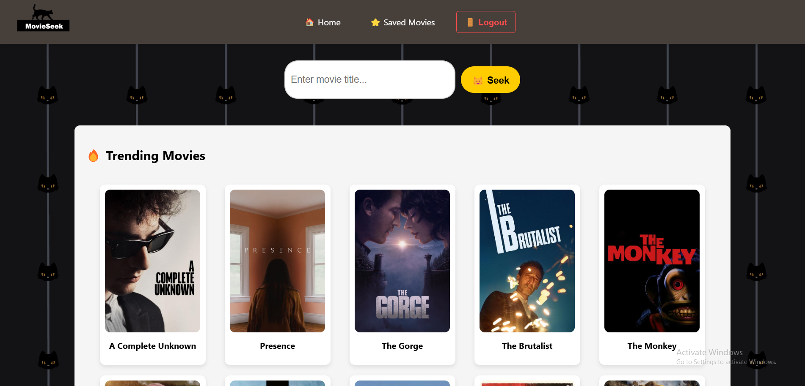

# MovieSeek 🎬


MovieSeek is a **modern and user-friendly** movie search web application. It allows users to **explore** movies, **watch trailers**, **save favorites**, and **manage their movie collection** with a seamless user experience.

---

## **Key Features** ✨

✔️ **Movie Search:** Find detailed movie information using an intuitive search interface.  
✔️ **Movie Trailers:** Watch trailers for movies directly from the app.  
✔️ **Trending & Top Rated:** Discover popular and top-rated movies.  
✔️ **User Authentication:** Secure login and registration for a personalized experience.  
✔️ **Favorites Management:** Save and manage your favorite movies in your personal account.  
✔️ **Microservices Architecture:** Backend communicates with a **separate microservice** to fetch movie data from **TMDB API**.  
✔️ **Dockerized MySQL Database:** Uses the **official MySQL container from Docker Hub** for storing user data and saved movies.  

---

## **Technology Stack** 🛠️

MovieSeek is built using a **modern, scalable** technology stack:

### **Backend** 🚀

🔹 **[FastAPI](https://fastapi.tiangolo.com/)** - High-performance Python framework for APIs.  
🔹 **MySQL (Dockerized)** - Uses the **official MySQL container from Docker Hub** for user authentication and saved movies.  
🔹 **TMDB API Microservice** - A separate **FastAPI-based microservice** that fetches movie data, genres, and trailers from **[TMDB](https://www.themoviedb.org/)**.  
🔹 **JWT Authentication** - Secure authentication and session management using JSON Web Tokens.  

### **Frontend** 🎨

🔹 **[React](https://reactjs.org/)** - Builds a dynamic, responsive UI.  
🔹 **CSS & Styled Components** - Ensures a sleek, movie-themed design.  

### **Infrastructure & Deployment** 🏗️

🔹 **[Docker](https://www.docker.com/)** - **Backend, microservice, and MySQL database** run inside Docker containers.  
🔹 **FastAPI Microservices** - Uses a **modular approach** for better maintainability and separation of concerns.  

---

## **Screenshots** 📸
  

---

## **Project Structure** 🌳
```
movieseek
    ├── README.md
    ├── ReadMePics
    │   ├── HomePage.png
    │   └── MovieSeekLogo.png
    ├── backend
    │   ├── Dockerfile
    │   ├── app
    │   ├── requirements.txt
    │   └── tests
    ├── docker-compose.yml
    ├── frontend
    │   ├── Dockerfile
    │   ├── package-lock.json
    │   ├── package.json
    │   ├── public
    │   └── src
    └── microservices
        └── tmdb 
```
---

## **Environment Setup 🌱**

Before running the project, you need to set up the required **environment variables**.

### **1️⃣ Create an `.env` file**  
```bash
cp .env.example .env

2️⃣ Configure the following variables in .env:
```
# TMDB API Key for the microservice
API_KEY=your_actual_tmdb_api_key

# MySQL Database Configuration
DB_HOST=your_database_host
DB_NAME=your_database_name
DB_USER=your_database_user
DB_PASSWORD=your_database_password
MYSQL_ROOT_PASSWORD=your_root_password
```
3️⃣ Save the file. Your project will now use these variables at runtime.

How to Run the Project 🏃‍♂️
Follow these steps to clone, set up, and run MovieSeek on your local machine.
1️⃣ Clone the Repository
```
git clone https://github.com/yourusername/movieseek.git
cd movieseek
```
2️⃣ Start the Application (Docker Setup) 🐳
Ensure Docker and Docker Compose are installed on your machine.
```docker-compose up --build
```

This will start the following Docker containers:

Backend (FastAPI)
Frontend (React)
TMDB Microservice (FastAPI)
MySQL Database (Pulled from Docker Hub)
3️⃣ Access the App
📌 Frontend: http://localhost:3000
📌 Backend API: http://localhost:8000/docs (Swagger API documentation for testing endpoints.)
📌 TMDB Microservice: http://localhost:8001/docs (Swagger API docs for the microservice.)

How the Microservice Works 🛰️
The backend does not directly communicate with TMDB. Instead, it interacts with a FastAPI microservice that:

Receives requests from the backend for movie data.
Fetches data from TMDB API including movie details, genres, and trailers.
Returns the formatted data to the backend, which then sends it to the frontend.
This approach ensures:

Better modularity (Backend is independent of TMDB API changes).
Improved security (TMDB API key is stored only in the microservice).
Scalability (The microservice can be extended for more features).

Contributing 🤝
We welcome contributions! If you'd like to improve MovieSeek, follow these steps:

1️⃣ Fork the repository
2️⃣ Create a feature branch
3️⃣ Make your changes & submit a pull request


