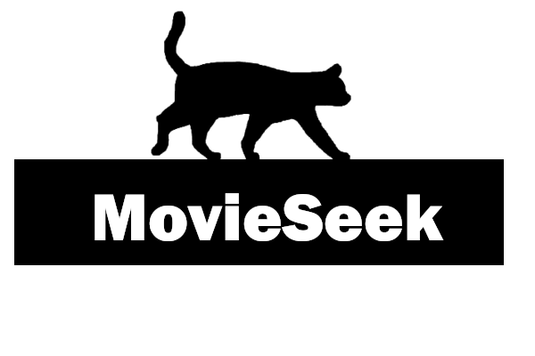
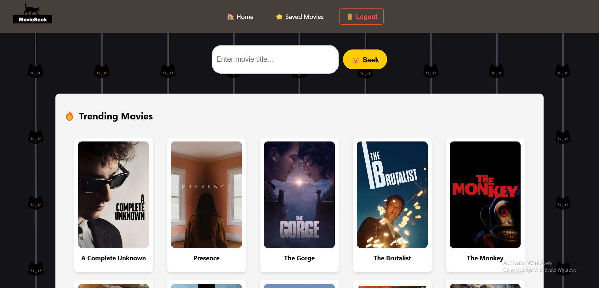

# MovieSeek 🎬



MovieSeek is a **modern and user-friendly** movie search web application. It allows users to **explore** movies, **watch trailers**, **save favorites**, and **manage their movie collection** with a seamless user experience.

---

## **Key Features** ✨

✔️ **Movie Search:** Find detailed movie information using an intuitive search interface.  
✔️ **Movie Trailers:** Watch trailers for movies directly from the app.  
✔️ **Trending & Top Rated:** Discover popular and top-rated movies.  
✔️ **User Authentication:** Secure login and registration for a personalized experience.  
✔️ **Favorites Management:** Save and manage your favorite movies in your personal account.  
✔️ **Microservices Architecture:** Backend communicates with a **separate microservice** to fetch movie data from **TMDB API**.  
✔️ **Dockerized MySQL Database:** Uses the **official MySQL container from Docker Hub** for storing user data and saved movies.  

---

## **Technology Stack** 🛠️

MovieSeek is built using a **modern, scalable** technology stack:

### **Backend** 🚀

🔹 **[FastAPI](https://fastapi.tiangolo.com/)** - High-performance Python framework for APIs.  
🔹 **MySQL** - Uses the **official MySQL container from Docker Hub** for user authentication and saved movies.  
🔹 **TMDB API Microservice** - A separate **FastAPI-based microservice** that fetches movie data, genres, and trailers from **[TMDB](https://www.themoviedb.org/)**.  
🔹 **JWT Authentication** - Secure authentication and session management using JSON Web Tokens.  

### **Frontend** 🎨

🔹 **[React](https://reactjs.org/)** - Builds a dynamic, responsive UI.  
🔹 **CSS & Styled Components** - Ensures a sleek, movie-themed design.  

### **Infrastructure & Deployment** 🏗️

🔹 **[Docker](https://www.docker.com/)** - **Backend, microservice, and MySQL database** run inside Docker containers.  
🔹 **FastAPI Microservices** - Uses a **modular approach** for better maintainability and separation of concerns.  

---

## **Screenshots** 📸
  

---

## **Project Structure** 🌳
```
movieseek
    ├── README.md
    ├── ReadMePics
    │   ├── HomePage.png
    │   └── MovieSeekLogo.png
    ├── backend
    │   ├── Dockerfile
    │   ├── app
    │   ├── requirements.txt
    │   └── tests
    ├── docker-compose.yml
    ├── frontend
    │   ├── Dockerfile
    │   ├── package-lock.json
    │   ├── package.json
    │   ├── public
    │   └── src
    └── microservices
        └── tmdb 
```
---

## **How to Set Up and Run the Project 🏃‍♂️**
### **1️⃣ Clone the Repository**
```bash
git clone [https://github.com/yourusername/movieseek.git](https://github.com/EASS-HIT-PART-A-2024-CLASS-VI/movieseek.git)
cd movieseek
```
### **2️⃣ Get a TMDB API Key 🔑**
To fetch movie data, you need an API key from **[TMDB (The Movie Database)](https://www.themoviedb.org/)**.

Steps to Get Your API Key:
1. Go to **[TMDB API Request Page](https://developer.themoviedb.org/docs/getting-started)**
2. Sign up for a free account if you don’t have one.
3. Navigate to API Keys under your account settings.
4. Click Request an API Key and follow the instructions.
5. Copy your API key once it’s generated.

You will need this API key when setting up your .env file.

### **3️⃣ Set Up Environment Variables** 🌱
MovieSeek requires an .env file for storing sensitive configuration details.

### Create an .env file
```bash
cp .env.example .env
```
Then, open the .env file and configure the following variables:
```bash
# TMDB API Key for the microservice
TMDB_API_KEY=your_actual_tmdb_api_key

# MySQL Database Configuration
DB_HOST=db
DB_NAME=your_database_name
DB_USER=your_database_user
DB_PASSWORD=your_database_password
MYSQL_ROOT_PASSWORD=your_root_password
```
🔹 Replace your_actual_tmdb_api_key with your TMDB API key.
🔹 Ensure the database credentials match those in docker-compose.yml.

Save and close the file.

## **4️⃣ Start the Application (Docker Setup)** 🐳
Ensure Docker and Docker Compose are installed on your machine.

Run:
```bash
docker-compose up --build
```
This will start the following Docker containers:
- Backend (FastAPI)
- Frontend (React)
- TMDB Microservice (FastAPI)
- MySQL Database (Pulled from Docker Hub)

## **5️⃣ Access the Application**
📌 Frontend: http://localhost:3000
📌 Backend API: http://localhost:8000/docs (Swagger API documentation for testing endpoints.)
📌 TMDB Microservice: http://localhost:8001/docs (Swagger API docs for the microservice.)

## **Demo Video**
Watch **[MovieSeek demo video](https://youtu.be/tVGkJzm23VA)**

## **How the TMDB Microservice Works** 🛰️
The backend does not directly communicate with TMDB. Instead, it interacts with a FastAPI microservice, which:

✔️ Receives requests from the backend for movie data.
✔️ Fetches data from TMDB API, including movie details, genres, and trailers.
✔️ Returns the formatted data to the backend, which then sends it to the frontend.

### **Why Use a Microservice?**
✅ Better Modularity - The backend is independent of TMDB API changes.
✅ Improved Security - TMDB API key is stored only in the microservice.
✅ Scalability - The microservice can be extended with more features in the future

## **Contact 📩**
For any questions, feel free to **open an issue**, reach out via **GitHub Discussions** or **email** vrabski@gmail.com.

## **Credits & Legal Notice** 🎭

This product uses the **TMDB API**.  
For more information, visit **[TMDB](https://www.themoviedb.org/)**.

